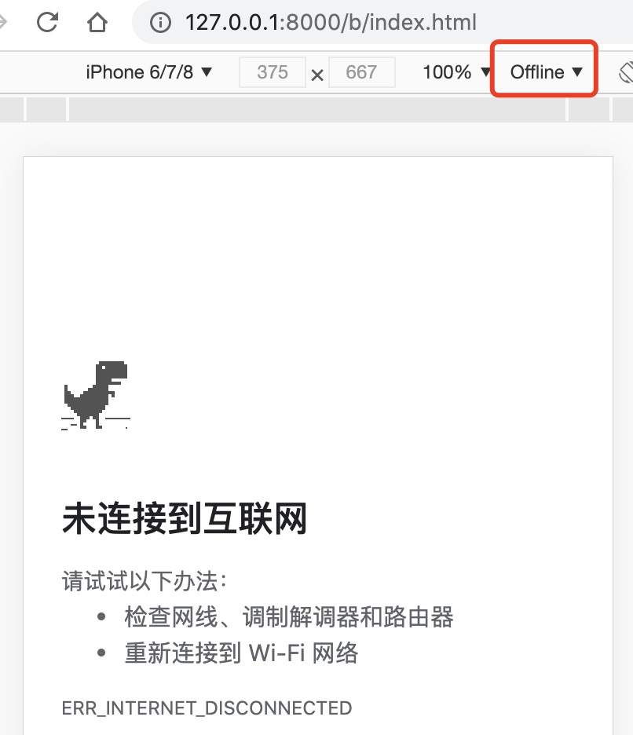
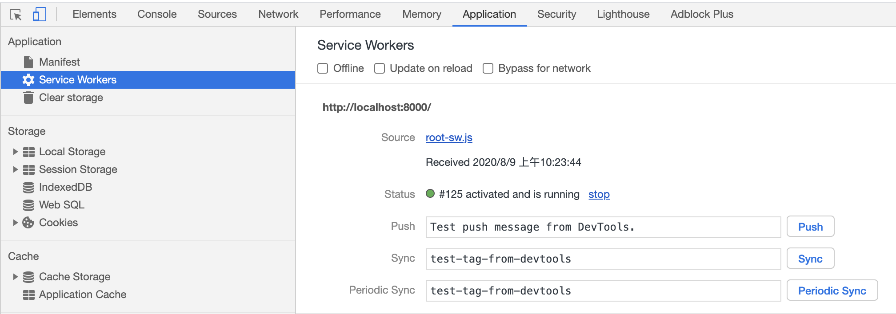

### 什么是service worker？

个人理解：service worker是在JavaScript主线程之外的独立的工作线程，与当前浏览器的主线程师完全隔离的，并且拥有自己独立的执行上下文（context）。

### service worker可以做什么事情？

#### 1.与缓存交互

你可以让 Service Worker 成为监听 `fetch` 事件的中间人。你也可以让 Service Worker 保存某些资源在缓存里。当缓存项被请求，Service Worker 无需发出额外的请求就可以返回缓存数据。只要资源被缓存，浏览器无需网络连接就可以展示内容。

#### 2.发送推送通知

在“当浏览器窗口被关闭，Service Worker 仍然是活着的”情况下，你可以实现诸如推送通知的事情。

#### 3.后台同步运行

在浏览器没有打开的情况下激活，意味着 Service Worker 可以在用户不知情下在后台工作。也就是说当你在浏览器离线时发送一些文件，Service Worker 会在网络连接有效时再把它们上传到外部服务器。

### 多说无用，来看一个小demo...

我自己在本地搭建了一个非常非常简单的项目，目的就是展示一张图片。启动服务后是这个样子的。


是一个红红的大草莓，看起来很好吃吧...，注意看红色框框里面的当前网络状态是online，也就是网络正常的情况下。这自然没问题，那如果我把网络断开呢？

你以为是这个样子的：



实际上是这个样子的：


很神奇，在离线的情况下也可以用，是不是发现了新大陆。

**到这里我们可以发现，service 不仅是一个独立于主线程的工作线程，还是一个在离线状态下工作的工作线程。**

### service worker怎么用？

来个例子吧...

首先创建一个serviceWorkerDemo文件夹，目录如下：

```javascript
└── serviceWorkerDemo
    ├── index.html
    └── sw.js
```

在index.html里面添加如下代码：

```html
<!DOCTYPE html>
  <head>
    <title>Service Worker Demo</title>
  </head>
  <body>
    <script>
      navigator.serviceWorker.register('./sw.js')
    </script>
  </body>
</html>
```

sw.js可以暂时为空，表示service worker什么也不做。

然后在该项目根目录下启动一个服务。启动后可以在浏览器内打开你刚才启动服务的地址。本文使用的地址是`localhost:8000`。启动成功后可以打开Chrome的devtooles。切换至application选项

可以看到service worker开始工作了。

