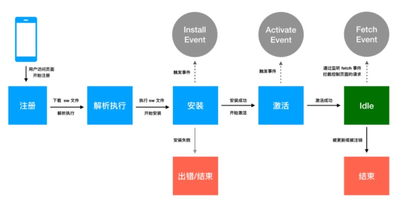
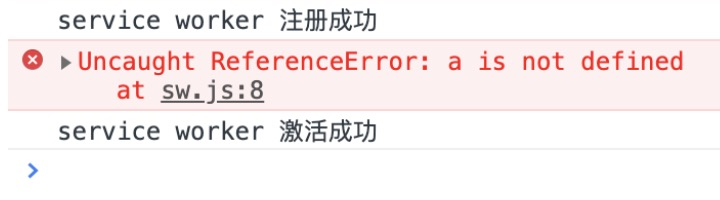
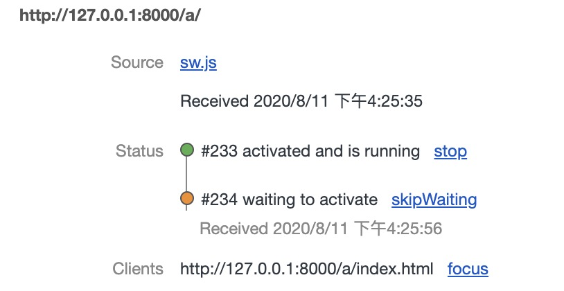
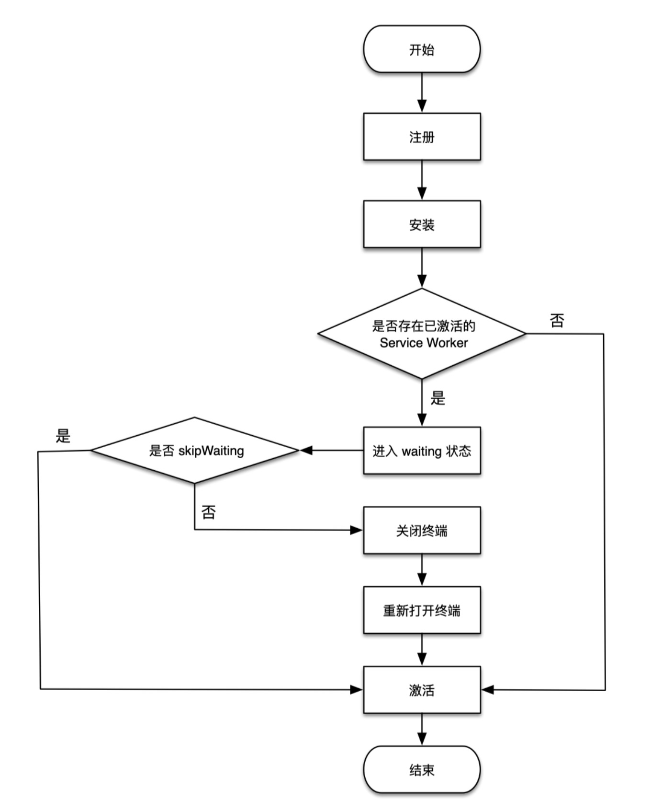

### service worker工作原理

在service worker的工作原理主要体现在他的工作周期上，在特定的生命周期内可以做一些缓存的读写，请求的拦截等操作



1. 在主线程成功注册 Service Worker 之后，开始下载并解析执行 Service Worker 文件，执行过程中开始安装 Service Worker，在此过程中会触发 worker 线程的 install 事件。
2. 如果 install 事件回调成功执行（在 install 回调中通常会做一些缓存读写的工作，可能会存在失败的情况），则开始激活 Service Worker，在此过程中会触发 worker 线程的 activate 事件，如果 install 事件回调执行失败，则生命周期进入 Error 终结状态，终止生命周期。
3. 完成激活之后，Service Worker 就能够控制作用域下的页面的资源请求，可以监听 fetch 事件。
4. 如果在激活后 Service Worker 被 unregister 或者有新的 Service Worker 版本更新，则当前 Service Worker 生命周期完结，进入 Terminated 终结状态。

我们可以通过一个demo来细说一下：

```makefile
.
└── serviceWorkerLifecycleDemo/
    ├── imgs/
    │   └── dog.jpg
    ├── index.html
    └── sw.js

```

然后在index.htm里面注册

```html
<body>
  
  <script>
    if ('serviceWorker' in navigator) {
    // 由于 127.0.0.1:8000 是所有测试 Demo 的 host
    // 为了防止作用域污染，将安装前注销所有已生效的 Service Worker
    navigator.serviceWorker.getRegistrations()
      .then(regs => {
        for (let reg of regs) {
          reg.unregister()
        }
        navigator.serviceWorker.register('./sw.js')
      })
    }
  </script>
</body>
```

注意：`由于 Service Worker 一旦注册后就会永久生效，为了防止service worker被之前注册的service worker污染，所以在注册之前需要将其他的service worker给注销掉。也可以砸chrome的devtools中手动unregister.`

编写完成index.html后，需要在s w.js里面添加如下代码：

```js
// sw.js
console.log('service worker 注册成功')

self.addEventListener('install', () => {
  // 安装回调的逻辑处理
  console.log('service worker 安装成功')
})

self.addEventListener('activate', () => {
  // 激活回调的逻辑处理
  console.log('service worker 激活成功')
})

self.addEventListener('fetch', event => {
  console.log('service worker 抓取请求成功: ' + event.request.url)
})
```

首次访问`http://127.0.0.1:8000`后打开控制台，可以发现：

```js
service worker 注册成功
service worker 安装成功
service worker 激活成功
```

当第二次刷新界面时候，控制台会打印如下：

```js
service worker 抓取请求成功：http://127.0.0.1:8000/imgs/dog.jpg
```

对比两次打印结果可以发现一些问题：

- Service Worker 文件只在首次注册的时候执行了一次。
- 安装、激活流程也只是在首次执行 Service Worker 文件的时候进行了一次。
- 首次注册成功的 Service Worker 没能拦截当前页面的请求。
- 非首次注册的 Service Worker 可以控制当前的页面并能拦截请求。

这是由于service worker是有一套特有的工作流程：


实际上 Service Worker 首次注册或者有新版本触发更新的时候，才会重新创建一个 worker 工作线程并解析执行 Service Worker 文件，

而在首次注册、安装、激活之后，Service Worker 已经拿到了当前页面的控制权了，但为什么首次刷新却没有拦截到网络请求呢？主要是因为在 Service Worker 的注册是一个异步的过程，在激活完成后当前页面的请求都已经发送完成，因为时机太晚，此时是拦截不到任何请求的，只能等待下次访问再进行。

而第二次刷新页面，由于当前站点的 Service Worker 是处于激活状态，所以不会再次新建 worker 工作线程并执行 Service Worker。也就是说激活状态的 Service Worker 在一个站点只会存在一个 worker 工作线程，除非 Service Worker 文件发生了变化（手动 unregister Service Worker 也会注销掉 worker 工作线程），触发了浏览器更新，才会重新开启生命周期。而由于 Service Worker 工作线程的离线特性，只要处于激活状态，在后续的任何访问中，都会通过 fetch 事件监听器拦截当前页面的网络请求，并执行 `fetch` 事件回调。

#### 离线缓存

在install事件里面可以对一些静态资源进行缓存，在下次请求资源时可以直接从缓存里面返回。

* 对资源进行缓存

```js
const CACHE_NAMES = 'v1'
const CACHE_URLS = [
  '/',
  './index.html',
  './index.js'
]

self.addEventListener('install', (event) => {
  // 跳过等待，直接激活
  self.skipWaiting()
  event.waitUntil(caches.open(CACHE_NAMES).then(cache => {
    return cache.addAll(CACHE_URLS)
  }))
})
```

* 从缓存中返回资源

```js
self.addEventListener('fetch', (event) => {
  event.respondWith(caches.match(event.request))
})
```

这时网页已经可以在离线状态下访问了。

#### waitUntil机制

如果service worker安装失败会怎么样？

我们可以在install里面加一行错误代码

```js
self.addEventListener('install', () => {
  // 一段一定会报错的代码
  console.log(a.b)
  console.log('service worker 安装成功')
})
```

很明显，变量a没有提前定义。这行代码自然会抛错。

运行后发现：虽然控制台报错了，但是service worker还是激活成功了。



从运行结果看，当 install 回调中的逻辑报错了，并不会影响 Service Worker 的生命周期继续向后推进，因为运行结果还是有 `激活成功`，甚至第二次刷新发现还能正常拦截请求。

这个原因是为什么呢？

由于 Service Worker 生命周期异步触发的特性，并不是像同步执行模式，如果报错就会中断执行。

Service Worker 事件回调的参数是一个 ExtendableEvent 对象，在 Service Worker 中需要使用 `ExtendableEvent.waitUntil()` 方法来保证生命周期的执行顺序。该方法接收一个 Promise 参数，开发者通常会将安装的回调执行逻辑（如缓存的写入）封装在一个 Promise 里，如果操作报错应该通过 Promise 来 reject 错误，这样 Service Worker 就知道了安装失败，然后 Service Worker 就能中断生命周期。

```js
self.addEventListener('install', event => {
  // 引入 event.waitUntil 方法
  event.waitUntil(new Promise((resolve, reject) => {
    // 模拟 promise 返回错误结果的情况
    reject('安装出错')
    // resolve('安装成功')
  }))
})

```

当 `ExtendableEvent.waitUntil()` 运行时，如果 Promise 是 resolved，任何事情都不会发生；如果 Promise 是 rejected，installing 或者 activating 的状态会被设置为 redundant。

可以发现：**通过waitUntil机制可以保证service worker生命周期的执行顺序**

使用waitUntil机制可以保证项目所需要的资源全部被cache完成后才会安装。

### service worker更新

之前说到service worker的更新有两个条件：

* url的变化

* sw.js文件内容的变化。

我们来修改一下sw.js文件的内容。看一下生命周期的执行情况。结果发现只打印了`注册成功`。说明执行了安装回调函数，但是没有激活成功。打开devtools看一下。



原来卡在了了waiting阶段。这个时候有两种办法可以激活service worker。

* 关闭所有终端（标签）

* 通过skipWaiting跳过等待

第一种办法自然不用多说，来看一下skipWaiting是个啥吧？

先来看一下service worker的更新流程吧



可以发现sw更新后会立即安装，这时候会判断之前有没有激活，若没有，则立即激活。若激活了，则会进入waiting状态。这时候需要通过skipWating或者关闭终端才可以激活service worker。

service worker在全局提供了一个skipWaiting方法一般在install事件中调用。

```js
self.addEventListener('install', (event) => {
  //跳过等待，直接激活
  self.skipWaiting()
  event.waitUntil(new Promise((resolve, reject) => {
    resolve('成功')
  }))
})
```

#### 手动更新

当刷新页面重新执行 register 方法的时候，浏览器检测到 Service Worker 文件更新就会触发 Service Worker 更新，但是如果站点在浏览器后台长时间没有被刷新，则浏览器将自动检查更新，通常是每隔 24 小时检查一次，但是 24 小时也太长了，所以也可以在代码中手动触发更新，

```js
navigator.serviceWorker.register('/sw.js')
  .then(reg => {
    setInterval(() => {
      reg.update()
    }, 60 * 60 * 1000)
  })
```

